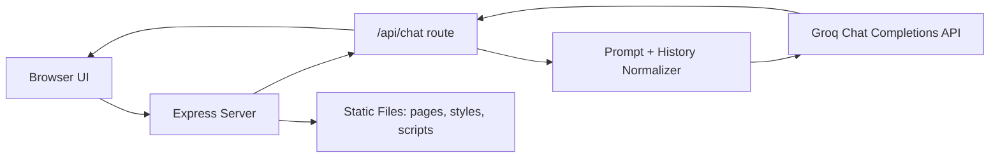

# Hostel Booking Platform


A modern student-hostel discovery and booking web app for Kenyan campuses, with a Groq-powered chat assistant for booking guidance, pricing help, and quick support direction.

## Table of Contents

| Section | What You Will Find |
| --- | --- |
| [Overview](#overview) | Purpose, scope, and high-level app setup |
| [Key Features](#key-features) | Core capabilities of the platform |
| [Architecture](#architecture) | Frontend-backend-Groq flow diagram |
| [Project Structure](#project-structure) | Folder layout and file responsibilities |
| [Quick Start](#quick-start) | Installation and local run steps |
| [Environment Variables](#environment-variables) | Configurable runtime settings |
| [Chat API](#chat-api) | Endpoint contract with payload examples |
| [Pages](#pages) | Main web pages and their paths |
| [Troubleshooting](#troubleshooting) | Common issues and practical fixes |
| [Security Notes](#security-notes) | Key-handling and deployment safety guidance |

## Overview

This project is split into:

- Frontend static app (HTML, CSS, vanilla JS) served by Express.
- Backend API for chatbot replies at `/api/chat`.
- Groq LLM integration with concise response controls and fallback mode.

## Key Features

- University-based hostel browsing and filtering.
- Hostel booking workflow with local state persistence.
- Contact and FAQ sections for student support.
- AI assistant widget with:
  - animated reply reveal,
  - animated thinking state,
  - enforced minimum thinking delay,
  - concise, easy-to-read replies.
- Demo-safe fallback when API key is missing.

## Architecture



## Project Structure

```text
Hostel/
├─ backend/
│  ├─ server.js          # Express server + Groq chat API
│  ├─ routes/            # Reserved for API modularization
│  └─ services/          # Reserved for service-layer logic
├─ pages/
│  ├─ index.html
│  ├─ hostels.html
│  ├─ booking.html
│  ├─ contact.html
│  └─ universities.html
├─ scripts/
│  └─ script.js          # Frontend behavior + chatbot UI logic
├─ styles/
│  └─ style.css
├─ .env                  # Local secrets (not committed)
├─ .gitignore
├─ package.json
└─ README.md
```

## Quick Start

### 1. Install dependencies

```bash
npm install
```

### 2. Create `.env`

Create a `.env` file in the project root with:

```env
GROQ_API_KEY=your_groq_api_key_here
GROQ_MODEL=llama-3.1-8b-instant
RESPONSE_MAX_TOKENS=120
PORT=3000
```

### 3. Run the app

```bash
npm start
```

Then open:

- `http://localhost:3000/pages/index.html`

## Environment Variables

| Variable | Required | Default | Purpose |
| --- | --- | --- | --- |
| `GROQ_API_KEY` | Yes (for live AI) | - | Auth token for Groq API |
| `GROQ_MODEL` | No | `llama-3.1-8b-instant` | Model used for chat generation |
| `RESPONSE_MAX_TOKENS` | No | `120` | Upper token cap for concise responses |
| `PORT` | No | `3000` | Server port |

## Chat API

### Endpoint

- `POST /api/chat`

### Request body

```json
{
  "message": "How do I book near Kisii University?",
  "history": [
    { "role": "user", "content": "Hello" },
    { "role": "assistant", "content": "Hi, how can I help?" }
  ]
}
```

### Response shape

```json
{
  "reply": "Open Hostels, filter by university and budget, then submit Booking.",
  "mode": "groq"
}
```

Possible `mode` values:

- `groq` (live AI)
- `demo` (no key configured)
- `fallback` (provider temporarily unavailable)

## Pages

- Home: [pages/index.html](pages/index.html)
- Universities: [pages/universities.html](pages/universities.html)
- Hostels: [pages/hostels.html](pages/hostels.html)
- Booking: [pages/booking.html](pages/booking.html)
- Contact: [pages/contact.html](pages/contact.html)

## Troubleshooting

### Port 3000 already in use

If startup fails with `EADDRINUSE`, stop the process using port 3000, then restart:

```powershell
Get-NetTCPConnection -LocalPort 3000 -State Listen | Select-Object -ExpandProperty OwningProcess
Stop-Process -Id <PID> -Force
npm start
```

### Chatbot returns demo mode

- Ensure `GROQ_API_KEY` is set in `.env`.
- Restart the server after any `.env` change.

### Styles or scripts not loading

This project uses root-based asset paths (`/styles/...`, `/scripts/...`), so run through Express and not direct file open.

## Security Notes

- Never commit `.env`.
- Rotate keys if exposed in chat logs or screenshots.
- Keep provider keys server-side only; do not place them in frontend JS.

---

### Maintainer Notes

Current backend is centralized in [backend/server.js](backend/server.js). The [backend/routes](backend/routes) and [backend/services](backend/services) folders are already created and ready for modular expansion.
